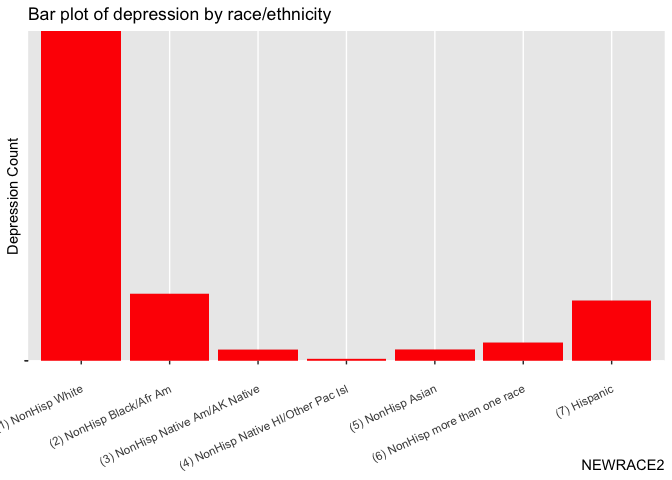
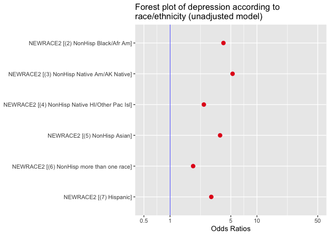
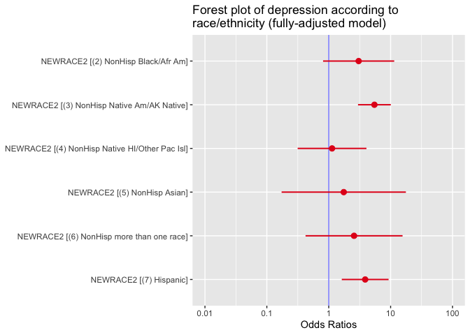
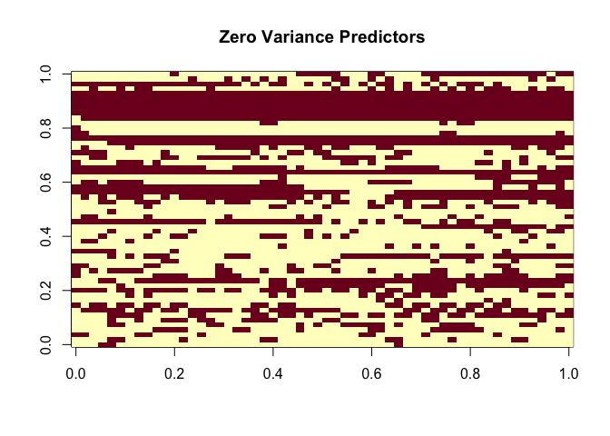
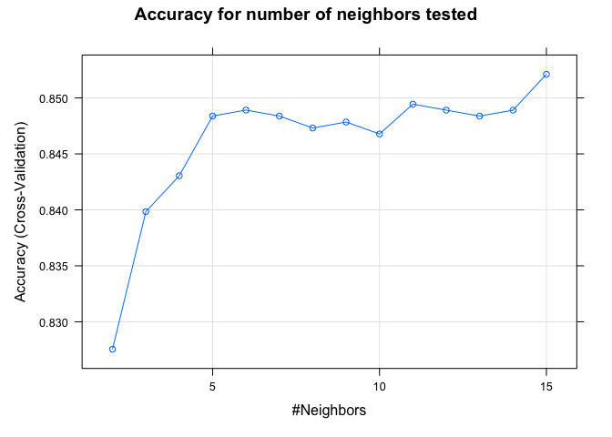
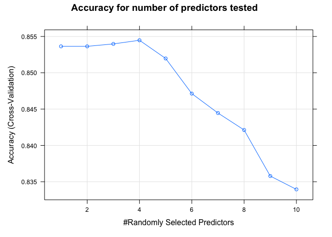
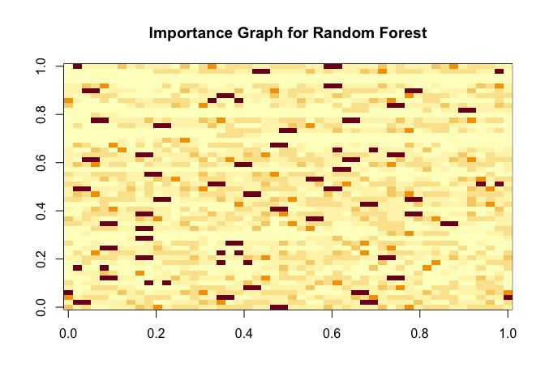

NSDUH Final Project
================
Jesse Osmar Najarro
2022-12-06

\#Load in data and packages

``` r
load("/Users/jesse/Downloads/ICPSR_36361/DS0001/36361-0001-Data.rda")
library(tidyverse)
```

    ## ── Attaching packages ─────────────────────────────────────── tidyverse 1.3.2 ──
    ## ✔ ggplot2 3.4.0      ✔ purrr   0.3.5 
    ## ✔ tibble  3.1.8      ✔ dplyr   1.0.10
    ## ✔ tidyr   1.2.1      ✔ stringr 1.5.0 
    ## ✔ readr   2.1.3      ✔ forcats 0.5.2 
    ## ── Conflicts ────────────────────────────────────────── tidyverse_conflicts() ──
    ## ✖ dplyr::filter() masks stats::filter()
    ## ✖ dplyr::lag()    masks stats::lag()

``` r
library(dslabs)
library(caret)
```

    ## Loading required package: lattice
    ## 
    ## Attaching package: 'caret'
    ## 
    ## The following object is masked from 'package:purrr':
    ## 
    ##     lift

\#Exploring data

``` r
data<- da36361.0001

#Exploring outcome var 
unique(data$AMDEYR)
```

    ## [1] (2) AMDELT=1 & ADPB2WK=2       (1) Yes (AMDELT=1 & ADPB2WK=1)
    ## [3] <NA>                          
    ## Levels: (1) Yes (AMDELT=1 & ADPB2WK=1) (2) AMDELT=1 & ADPB2WK=2

``` r
#Need to make sure its a factor for regression and classification
levels(data$AMDEYR) 
```

    ## [1] "(1) Yes (AMDELT=1 & ADPB2WK=1)" "(2) AMDELT=1 & ADPB2WK=2"

``` r
summary(data$AMDEYR)
```

    ## (1) Yes (AMDELT=1 & ADPB2WK=1)       (2) AMDELT=1 & ADPB2WK=2 
    ##                           3186                          38019 
    ##                           NA's 
    ##                          14066

``` r
#Renaming outcome var 
levels(data$AMDEYR) <- c("Yes", "No")

#Checking it went through
summary(data$AMDEYR)
```

    ##   Yes    No  NA's 
    ##  3186 38019 14066

``` r
#Checking our independent variable
class(data$NEWRACE2)
```

    ## [1] "factor"

``` r
levels(data$NEWRACE2)
```

    ## [1] "(1) NonHisp White"                   "(2) NonHisp Black/Afr Am"           
    ## [3] "(3) NonHisp Native Am/AK Native"     "(4) NonHisp Native HI/Other Pac Isl"
    ## [5] "(5) NonHisp Asian"                   "(6) NonHisp more than one race"     
    ## [7] "(7) Hispanic"

``` r
summary(data$NEWRACE2)
```

    ##                   (1) NonHisp White            (2) NonHisp Black/Afr Am 
    ##                               33534                                6693 
    ##     (3) NonHisp Native Am/AK Native (4) NonHisp Native HI/Other Pac Isl 
    ##                                 907                                 299 
    ##                   (5) NonHisp Asian      (6) NonHisp more than one race 
    ##                                2355                                1959 
    ##                        (7) Hispanic 
    ##                                9524

``` r
#Preprocessing 

#Drop AGE<18 categories
`%notin%` <- Negate(`%in%`)
data_prac <- data[data$AGE2 %notin% c("(01) Respondent is 12 years old", "(02) Respondent is 13 years old", "(03) Respondent is 14 years old", "(04) Respondent is 15 years old", "(05) Respondent is 16 years old", "(06) Respondent is 17 years old"), ]

data_prac <- data[data$EDUCCAT2 %notin% c("(5) 12 to 17 year olds (AGE2<=6)"), ]

#Checking it all went through
data_prac$AGE2 <- factor(data_prac$AGE2)
levels(data_prac$AGE2)
```

    ##  [1] "(07) Respondent is 18 years old"               
    ##  [2] "(08) Respondent is 19 years old"               
    ##  [3] "(09) Respondent is 20 years old"               
    ##  [4] "(10) Respondent is 21 years old"               
    ##  [5] "(11) Respondent is 22 or 23 years old"         
    ##  [6] "(12) Respondent is 24 or 25 years old"         
    ##  [7] "(13) Respondent is between 26 and 29 years old"
    ##  [8] "(14) Respondent is between 30 and 34 years old"
    ##  [9] "(15) Respondent is between 35 and 49 years old"
    ## [10] "(16) Respondent is between 50 and 64 years old"
    ## [11] "(17) Respondent is 65 years old or older"

``` r
data_prac$EDUCCAT2 <- factor(data_prac$EDUCCAT2)
levels(data_prac$EDUCCAT2)
```

    ## [1] "(1) Less than high school (IREDUC2<=7 and AGE2>=7)"
    ## [2] "(2) High school graduate (IREDUC2=8 and AGE2>=7)"  
    ## [3] "(3) Some college (IREDUC2=9-10 and AGE2>=7)"       
    ## [4] "(4) College graduate (IREDUC2=11 and AGE2>=7)"

``` r
#Refactoring levels of AGE
library(plyr)
```

    ## ------------------------------------------------------------------------------

    ## You have loaded plyr after dplyr - this is likely to cause problems.
    ## If you need functions from both plyr and dplyr, please load plyr first, then dplyr:
    ## library(plyr); library(dplyr)

    ## ------------------------------------------------------------------------------

    ## 
    ## Attaching package: 'plyr'

    ## The following objects are masked from 'package:dplyr':
    ## 
    ##     arrange, count, desc, failwith, id, mutate, rename, summarise,
    ##     summarize

    ## The following object is masked from 'package:purrr':
    ## 
    ##     compact

``` r
data_prac$AGE2 <- revalue(data_prac$AGE2, c("(07) Respondent is 18 years old" = "(1) Respondent is 18 years old", '(08) Respondent is 19 years old' = '(2) Respondent is 19 years old', '(09) Respondent is 20 years old' = '(3) Respondent is 20 years old', '(10) Respondent is 21 years old'='(4) Respondent is 21 years old', '(11) Respondent is 22 or 23 years old'='(5) Respondent is 22 or 23 years old', '(12) Respondent is 24 or 25 years old'='(6) Respondent is 24 or 25 years old', '(13) Respondent is between 26 and 29 years old'='(7) Respondent is between 26 and 29 years old', '(14) Respondent is between 30 and 34 years old' = '(8) Respondent is between 30 and 34 years old', '(15) Respondent is between 35 and 49 years old'= '(9) Respondent is between 35 and 49 years old', '(16) Respondent is between 50 and 64 years old'='(10) Respondent is between 50 and 64 years old', '(17) Respondent is 65 years old or older'= '(11) Respondent is 65 years old or older'))

#Checking it went through
levels(data_prac$AGE2)
```

    ##  [1] "(1) Respondent is 18 years old"                
    ##  [2] "(2) Respondent is 19 years old"                
    ##  [3] "(3) Respondent is 20 years old"                
    ##  [4] "(4) Respondent is 21 years old"                
    ##  [5] "(5) Respondent is 22 or 23 years old"          
    ##  [6] "(6) Respondent is 24 or 25 years old"          
    ##  [7] "(7) Respondent is between 26 and 29 years old" 
    ##  [8] "(8) Respondent is between 30 and 34 years old" 
    ##  [9] "(9) Respondent is between 35 and 49 years old" 
    ## [10] "(10) Respondent is between 50 and 64 years old"
    ## [11] "(11) Respondent is 65 years old or older"

``` r
#Making dummy variables out of the predictors 
predictors <- data_prac|> select(AGE2, IRSEX, INCOME, EDUCCAT2, WRKEDYR, ALCDAYS, CIG30USE, LIFANXD, LIFDIAB, LIFHBP)

#Find class of all predictors
sapply(predictors, class)
```

    ##      AGE2     IRSEX    INCOME  EDUCCAT2   WRKEDYR   ALCDAYS  CIG30USE   LIFANXD 
    ##  "factor"  "factor"  "factor"  "factor"  "factor" "numeric" "numeric"  "factor" 
    ##   LIFDIAB    LIFHBP 
    ##  "factor"  "factor"

``` r
#Data frame of factor predictors 
predictors_factors<- data_prac|> select(NEWRACE2, AGE2, IRSEX, INCOME, EDUCCAT2, WRKEDYR, LIFANXD, LIFDIAB, LIFHBP)

#Levels of factor predictors 
sapply(predictors_factors, levels)
```

    ## $NEWRACE2
    ## [1] "(1) NonHisp White"                   "(2) NonHisp Black/Afr Am"           
    ## [3] "(3) NonHisp Native Am/AK Native"     "(4) NonHisp Native HI/Other Pac Isl"
    ## [5] "(5) NonHisp Asian"                   "(6) NonHisp more than one race"     
    ## [7] "(7) Hispanic"                       
    ## 
    ## $AGE2
    ##  [1] "(1) Respondent is 18 years old"                
    ##  [2] "(2) Respondent is 19 years old"                
    ##  [3] "(3) Respondent is 20 years old"                
    ##  [4] "(4) Respondent is 21 years old"                
    ##  [5] "(5) Respondent is 22 or 23 years old"          
    ##  [6] "(6) Respondent is 24 or 25 years old"          
    ##  [7] "(7) Respondent is between 26 and 29 years old" 
    ##  [8] "(8) Respondent is between 30 and 34 years old" 
    ##  [9] "(9) Respondent is between 35 and 49 years old" 
    ## [10] "(10) Respondent is between 50 and 64 years old"
    ## [11] "(11) Respondent is 65 years old or older"      
    ## 
    ## $IRSEX
    ## [1] "(1) Male"   "(2) Female"
    ## 
    ## $INCOME
    ## [1] "(1) Less than $20,000" "(2) $20,000 - $49,999" "(3) $50,000 - $74,999"
    ## [4] "(4) $75,000 or More"  
    ## 
    ## $EDUCCAT2
    ## [1] "(1) Less than high school (IREDUC2<=7 and AGE2>=7)"
    ## [2] "(2) High school graduate (IREDUC2=8 and AGE2>=7)"  
    ## [3] "(3) Some college (IREDUC2=9-10 and AGE2>=7)"       
    ## [4] "(4) College graduate (IREDUC2=11 and AGE2>=7)"     
    ## 
    ## $WRKEDYR
    ## [1] "(1) Yes" "(2) No" 
    ## 
    ## $LIFANXD
    ## [1] "(1) Response entered"     "(6) Response not entered"
    ## 
    ## $LIFDIAB
    ## [1] "(1) Response entered"     "(6) Response not entered"
    ## 
    ## $LIFHBP
    ## [1] "(1) Response entered"     "(6) Response not entered"

``` r
#Transform factor predictors to categorical 
library(fastDummies)
data_dummy<- data_prac

data_dummy<- data_dummy[!is.na(data_dummy$AMDEYR),]
data_dummy<- data_dummy[!is.na(data_dummy$NEWRACE2),]

data_dummy<- data_dummy[!is.na(data_dummy$AGE2),]

data_dummy<- data_dummy[!is.na(data_dummy$IRSEX),]
data_dummy<- data_dummy[!is.na(data_dummy$INCOME),]
data_dummy<- data_dummy[!is.na(data_dummy$EDUCCAT2),]
data_dummy<- data_dummy[!is.na(data_dummy$WRKEDYR),]
data_dummy<- data_dummy[!is.na(data_dummy$LIFANXD),]
data_dummy<- data_dummy[!is.na(data_dummy$LIFHBP),]

data_dummy<- dummy_cols(data_dummy, select_columns= c("NEWRACE2", "AGE2", "IRSEX", "INCOME", "EDUCCAT2", "WRKEDYR", "LIFANXD", "LIFDIAB", "LIFHBP"),ignore_na=TRUE)

#Barplot 
library(ggplot2)
ggplot(data_dummy, aes(x=NEWRACE2, y=AMDEYR)) +geom_bar(stat="identity", fill="red") + ggtitle("Bar plot of depression by race/ethnicity")+ theme(axis.text.x = element_text(angle = 25, vjust = 0.8, hjust=1))+ylab("Depression Count") + theme(axis.title.x = element_text(hjust=1)) +  theme(axis.text.y=element_blank()) 
```

<!-- -->

``` r
#Table 1 
library(tableone)
vars<- c("NEWRACE2", "AGE2", "IRSEX", "INCOME", "EDUCCAT2", "WRKEDYR", "LIFANXD", "LIFDIAB", "LIFHBP")
tableOne <- CreateTableOne(vars = vars, strata = c("NEWRACE2"), data = data_dummy)
tableOne
```

    ##                                                        Stratified by NEWRACE2
    ##                                                         (1) NonHisp White
    ##   n                                                     4982             
    ##   NEWRACE2 (%)                                                           
    ##      (1) NonHisp White                                  4982 (100.0)     
    ##      (2) NonHisp Black/Afr Am                              0 (  0.0)     
    ##      (3) NonHisp Native Am/AK Native                       0 (  0.0)     
    ##      (4) NonHisp Native HI/Other Pac Isl                   0 (  0.0)     
    ##      (5) NonHisp Asian                                     0 (  0.0)     
    ##      (6) NonHisp more than one race                        0 (  0.0)     
    ##      (7) Hispanic                                          0 (  0.0)     
    ##   AGE2 (%)                                                               
    ##      (1) Respondent is 18 years old                      169 (  3.4)     
    ##      (2) Respondent is 19 years old                      123 (  2.5)     
    ##      (3) Respondent is 20 years old                      119 (  2.4)     
    ##      (4) Respondent is 21 years old                      100 (  2.0)     
    ##      (5) Respondent is 22 or 23 years old                239 (  4.8)     
    ##      (6) Respondent is 24 or 25 years old                207 (  4.2)     
    ##      (7) Respondent is between 26 and 29 years old       233 (  4.7)     
    ##      (8) Respondent is between 30 and 34 years old       328 (  6.6)     
    ##      (9) Respondent is between 35 and 49 years old       786 ( 15.8)     
    ##      (10) Respondent is between 50 and 64 years old      896 ( 18.0)     
    ##      (11) Respondent is 65 years old or older           1782 ( 35.8)     
    ##   IRSEX = (2) Female (%)                                3095 ( 62.1)     
    ##   INCOME (%)                                                             
    ##      (1) Less than $20,000                              1492 ( 29.9)     
    ##      (2) $20,000 - $49,999                              1775 ( 35.6)     
    ##      (3) $50,000 - $74,999                               731 ( 14.7)     
    ##      (4) $75,000 or More                                 984 ( 19.8)     
    ##   EDUCCAT2 (%)                                                           
    ##      (1) Less than high school (IREDUC2<=7 and AGE2>=7)  822 ( 16.5)     
    ##      (2) High school graduate (IREDUC2=8 and AGE2>=7)   1754 ( 35.2)     
    ##      (3) Some college (IREDUC2=9-10 and AGE2>=7)        1356 ( 27.2)     
    ##      (4) College graduate (IREDUC2=11 and AGE2>=7)      1050 ( 21.1)     
    ##   WRKEDYR = (2) No (%)                                  3769 ( 75.7)     
    ##   LIFANXD = (6) Response not entered (%)                3644 ( 73.1)     
    ##   LIFDIAB = (6) Response not entered (%)                4213 ( 84.6)     
    ##   LIFHBP = (6) Response not entered (%)                 3009 ( 60.4)     
    ##                                                        Stratified by NEWRACE2
    ##                                                         (2) NonHisp Black/Afr Am
    ##   n                                                     986                     
    ##   NEWRACE2 (%)                                                                  
    ##      (1) NonHisp White                                    0 (  0.0)             
    ##      (2) NonHisp Black/Afr Am                           986 (100.0)             
    ##      (3) NonHisp Native Am/AK Native                      0 (  0.0)             
    ##      (4) NonHisp Native HI/Other Pac Isl                  0 (  0.0)             
    ##      (5) NonHisp Asian                                    0 (  0.0)             
    ##      (6) NonHisp more than one race                       0 (  0.0)             
    ##      (7) Hispanic                                         0 (  0.0)             
    ##   AGE2 (%)                                                                      
    ##      (1) Respondent is 18 years old                      55 (  5.6)             
    ##      (2) Respondent is 19 years old                      37 (  3.8)             
    ##      (3) Respondent is 20 years old                      31 (  3.1)             
    ##      (4) Respondent is 21 years old                      25 (  2.5)             
    ##      (5) Respondent is 22 or 23 years old                69 (  7.0)             
    ##      (6) Respondent is 24 or 25 years old                50 (  5.1)             
    ##      (7) Respondent is between 26 and 29 years old       52 (  5.3)             
    ##      (8) Respondent is between 30 and 34 years old       67 (  6.8)             
    ##      (9) Respondent is between 35 and 49 years old      205 ( 20.8)             
    ##      (10) Respondent is between 50 and 64 years old     198 ( 20.1)             
    ##      (11) Respondent is 65 years old or older           197 ( 20.0)             
    ##   IRSEX = (2) Female (%)                                631 ( 64.0)             
    ##   INCOME (%)                                                                    
    ##      (1) Less than $20,000                              561 ( 56.9)             
    ##      (2) $20,000 - $49,999                              295 ( 29.9)             
    ##      (3) $50,000 - $74,999                               76 (  7.7)             
    ##      (4) $75,000 or More                                 54 (  5.5)             
    ##   EDUCCAT2 (%)                                                                  
    ##      (1) Less than high school (IREDUC2<=7 and AGE2>=7) 262 ( 26.6)             
    ##      (2) High school graduate (IREDUC2=8 and AGE2>=7)   401 ( 40.7)             
    ##      (3) Some college (IREDUC2=9-10 and AGE2>=7)        232 ( 23.5)             
    ##      (4) College graduate (IREDUC2=11 and AGE2>=7)       91 (  9.2)             
    ##   WRKEDYR = (2) No (%)                                  712 ( 72.2)             
    ##   LIFANXD = (6) Response not entered (%)                866 ( 87.8)             
    ##   LIFDIAB = (6) Response not entered (%)                797 ( 80.8)             
    ##   LIFHBP = (6) Response not entered (%)                 561 ( 56.9)             
    ##                                                        Stratified by NEWRACE2
    ##                                                         (3) NonHisp Native Am/AK Native
    ##   n                                                     159                            
    ##   NEWRACE2 (%)                                                                         
    ##      (1) NonHisp White                                    0 (  0.0)                    
    ##      (2) NonHisp Black/Afr Am                             0 (  0.0)                    
    ##      (3) NonHisp Native Am/AK Native                    159 (100.0)                    
    ##      (4) NonHisp Native HI/Other Pac Isl                  0 (  0.0)                    
    ##      (5) NonHisp Asian                                    0 (  0.0)                    
    ##      (6) NonHisp more than one race                       0 (  0.0)                    
    ##      (7) Hispanic                                         0 (  0.0)                    
    ##   AGE2 (%)                                                                             
    ##      (1) Respondent is 18 years old                       4 (  2.5)                    
    ##      (2) Respondent is 19 years old                       7 (  4.4)                    
    ##      (3) Respondent is 20 years old                      12 (  7.5)                    
    ##      (4) Respondent is 21 years old                       7 (  4.4)                    
    ##      (5) Respondent is 22 or 23 years old                 9 (  5.7)                    
    ##      (6) Respondent is 24 or 25 years old                 7 (  4.4)                    
    ##      (7) Respondent is between 26 and 29 years old       10 (  6.3)                    
    ##      (8) Respondent is between 30 and 34 years old       14 (  8.8)                    
    ##      (9) Respondent is between 35 and 49 years old       37 ( 23.3)                    
    ##      (10) Respondent is between 50 and 64 years old      32 ( 20.1)                    
    ##      (11) Respondent is 65 years old or older            20 ( 12.6)                    
    ##   IRSEX = (2) Female (%)                                 91 ( 57.2)                    
    ##   INCOME (%)                                                                           
    ##      (1) Less than $20,000                               83 ( 52.2)                    
    ##      (2) $20,000 - $49,999                               54 ( 34.0)                    
    ##      (3) $50,000 - $74,999                               12 (  7.5)                    
    ##      (4) $75,000 or More                                 10 (  6.3)                    
    ##   EDUCCAT2 (%)                                                                         
    ##      (1) Less than high school (IREDUC2<=7 and AGE2>=7)  54 ( 34.0)                    
    ##      (2) High school graduate (IREDUC2=8 and AGE2>=7)    63 ( 39.6)                    
    ##      (3) Some college (IREDUC2=9-10 and AGE2>=7)         36 ( 22.6)                    
    ##      (4) College graduate (IREDUC2=11 and AGE2>=7)        6 (  3.8)                    
    ##   WRKEDYR = (2) No (%)                                  112 ( 70.4)                    
    ##   LIFANXD = (6) Response not entered (%)                129 ( 81.1)                    
    ##   LIFDIAB = (6) Response not entered (%)                122 ( 76.7)                    
    ##   LIFHBP = (6) Response not entered (%)                  96 ( 60.4)                    
    ##                                                        Stratified by NEWRACE2
    ##                                                         (4) NonHisp Native HI/Other Pac Isl
    ##   n                                                     22                                 
    ##   NEWRACE2 (%)                                                                             
    ##      (1) NonHisp White                                   0 (  0.0)                         
    ##      (2) NonHisp Black/Afr Am                            0 (  0.0)                         
    ##      (3) NonHisp Native Am/AK Native                     0 (  0.0)                         
    ##      (4) NonHisp Native HI/Other Pac Isl                22 (100.0)                         
    ##      (5) NonHisp Asian                                   0 (  0.0)                         
    ##      (6) NonHisp more than one race                      0 (  0.0)                         
    ##      (7) Hispanic                                        0 (  0.0)                         
    ##   AGE2 (%)                                                                                 
    ##      (1) Respondent is 18 years old                      0 (  0.0)                         
    ##      (2) Respondent is 19 years old                      0 (  0.0)                         
    ##      (3) Respondent is 20 years old                      1 (  4.5)                         
    ##      (4) Respondent is 21 years old                      2 (  9.1)                         
    ##      (5) Respondent is 22 or 23 years old                1 (  4.5)                         
    ##      (6) Respondent is 24 or 25 years old                0 (  0.0)                         
    ##      (7) Respondent is between 26 and 29 years old       3 ( 13.6)                         
    ##      (8) Respondent is between 30 and 34 years old       2 (  9.1)                         
    ##      (9) Respondent is between 35 and 49 years old       5 ( 22.7)                         
    ##      (10) Respondent is between 50 and 64 years old      4 ( 18.2)                         
    ##      (11) Respondent is 65 years old or older            4 ( 18.2)                         
    ##   IRSEX = (2) Female (%)                                12 ( 54.5)                         
    ##   INCOME (%)                                                                               
    ##      (1) Less than $20,000                              10 ( 45.5)                         
    ##      (2) $20,000 - $49,999                               6 ( 27.3)                         
    ##      (3) $50,000 - $74,999                               0 (  0.0)                         
    ##      (4) $75,000 or More                                 6 ( 27.3)                         
    ##   EDUCCAT2 (%)                                                                             
    ##      (1) Less than high school (IREDUC2<=7 and AGE2>=7)  9 ( 40.9)                         
    ##      (2) High school graduate (IREDUC2=8 and AGE2>=7)    9 ( 40.9)                         
    ##      (3) Some college (IREDUC2=9-10 and AGE2>=7)         3 ( 13.6)                         
    ##      (4) College graduate (IREDUC2=11 and AGE2>=7)       1 (  4.5)                         
    ##   WRKEDYR = (2) No (%)                                  17 ( 77.3)                         
    ##   LIFANXD = (6) Response not entered (%)                20 ( 90.9)                         
    ##   LIFDIAB = (6) Response not entered (%)                19 ( 86.4)                         
    ##   LIFHBP = (6) Response not entered (%)                 12 ( 54.5)                         
    ##                                                        Stratified by NEWRACE2
    ##                                                         (5) NonHisp Asian
    ##   n                                                     162              
    ##   NEWRACE2 (%)                                                           
    ##      (1) NonHisp White                                    0 (  0.0)      
    ##      (2) NonHisp Black/Afr Am                             0 (  0.0)      
    ##      (3) NonHisp Native Am/AK Native                      0 (  0.0)      
    ##      (4) NonHisp Native HI/Other Pac Isl                  0 (  0.0)      
    ##      (5) NonHisp Asian                                  162 (100.0)      
    ##      (6) NonHisp more than one race                       0 (  0.0)      
    ##      (7) Hispanic                                         0 (  0.0)      
    ##   AGE2 (%)                                                               
    ##      (1) Respondent is 18 years old                       9 (  5.6)      
    ##      (2) Respondent is 19 years old                       8 (  4.9)      
    ##      (3) Respondent is 20 years old                      11 (  6.8)      
    ##      (4) Respondent is 21 years old                       7 (  4.3)      
    ##      (5) Respondent is 22 or 23 years old                10 (  6.2)      
    ##      (6) Respondent is 24 or 25 years old                 7 (  4.3)      
    ##      (7) Respondent is between 26 and 29 years old       11 (  6.8)      
    ##      (8) Respondent is between 30 and 34 years old       12 (  7.4)      
    ##      (9) Respondent is between 35 and 49 years old       17 ( 10.5)      
    ##      (10) Respondent is between 50 and 64 years old      15 (  9.3)      
    ##      (11) Respondent is 65 years old or older            55 ( 34.0)      
    ##   IRSEX = (2) Female (%)                                103 ( 63.6)      
    ##   INCOME (%)                                                             
    ##      (1) Less than $20,000                               53 ( 32.7)      
    ##      (2) $20,000 - $49,999                               35 ( 21.6)      
    ##      (3) $50,000 - $74,999                               25 ( 15.4)      
    ##      (4) $75,000 or More                                 49 ( 30.2)      
    ##   EDUCCAT2 (%)                                                           
    ##      (1) Less than high school (IREDUC2<=7 and AGE2>=7)  18 ( 11.1)      
    ##      (2) High school graduate (IREDUC2=8 and AGE2>=7)    35 ( 21.6)      
    ##      (3) Some college (IREDUC2=9-10 and AGE2>=7)         52 ( 32.1)      
    ##      (4) College graduate (IREDUC2=11 and AGE2>=7)       57 ( 35.2)      
    ##   WRKEDYR = (2) No (%)                                  118 ( 72.8)      
    ##   LIFANXD = (6) Response not entered (%)                143 ( 88.3)      
    ##   LIFDIAB = (6) Response not entered (%)                130 ( 80.2)      
    ##   LIFHBP = (6) Response not entered (%)                 109 ( 67.3)      
    ##                                                        Stratified by NEWRACE2
    ##                                                         (6) NonHisp more than one race
    ##   n                                                     280                           
    ##   NEWRACE2 (%)                                                                        
    ##      (1) NonHisp White                                    0 (  0.0)                   
    ##      (2) NonHisp Black/Afr Am                             0 (  0.0)                   
    ##      (3) NonHisp Native Am/AK Native                      0 (  0.0)                   
    ##      (4) NonHisp Native HI/Other Pac Isl                  0 (  0.0)                   
    ##      (5) NonHisp Asian                                    0 (  0.0)                   
    ##      (6) NonHisp more than one race                     280 (100.0)                   
    ##      (7) Hispanic                                         0 (  0.0)                   
    ##   AGE2 (%)                                                                            
    ##      (1) Respondent is 18 years old                      18 (  6.4)                   
    ##      (2) Respondent is 19 years old                       9 (  3.2)                   
    ##      (3) Respondent is 20 years old                      20 (  7.1)                   
    ##      (4) Respondent is 21 years old                       8 (  2.9)                   
    ##      (5) Respondent is 22 or 23 years old                22 (  7.9)                   
    ##      (6) Respondent is 24 or 25 years old                14 (  5.0)                   
    ##      (7) Respondent is between 26 and 29 years old       16 (  5.7)                   
    ##      (8) Respondent is between 30 and 34 years old       18 (  6.4)                   
    ##      (9) Respondent is between 35 and 49 years old       56 ( 20.0)                   
    ##      (10) Respondent is between 50 and 64 years old      50 ( 17.9)                   
    ##      (11) Respondent is 65 years old or older            49 ( 17.5)                   
    ##   IRSEX = (2) Female (%)                                175 ( 62.5)                   
    ##   INCOME (%)                                                                          
    ##      (1) Less than $20,000                              117 ( 41.8)                   
    ##      (2) $20,000 - $49,999                               93 ( 33.2)                   
    ##      (3) $50,000 - $74,999                               28 ( 10.0)                   
    ##      (4) $75,000 or More                                 42 ( 15.0)                   
    ##   EDUCCAT2 (%)                                                                        
    ##      (1) Less than high school (IREDUC2<=7 and AGE2>=7)  76 ( 27.1)                   
    ##      (2) High school graduate (IREDUC2=8 and AGE2>=7)    85 ( 30.4)                   
    ##      (3) Some college (IREDUC2=9-10 and AGE2>=7)         82 ( 29.3)                   
    ##      (4) College graduate (IREDUC2=11 and AGE2>=7)       37 ( 13.2)                   
    ##   WRKEDYR = (2) No (%)                                  195 ( 69.6)                   
    ##   LIFANXD = (6) Response not entered (%)                199 ( 71.1)                   
    ##   LIFDIAB = (6) Response not entered (%)                233 ( 83.2)                   
    ##   LIFHBP = (6) Response not entered (%)                 187 ( 66.8)                   
    ##                                                        Stratified by NEWRACE2
    ##                                                         (7) Hispanic p     
    ##   n                                                     898                
    ##   NEWRACE2 (%)                                                       <0.001
    ##      (1) NonHisp White                                    0 (  0.0)        
    ##      (2) NonHisp Black/Afr Am                             0 (  0.0)        
    ##      (3) NonHisp Native Am/AK Native                      0 (  0.0)        
    ##      (4) NonHisp Native HI/Other Pac Isl                  0 (  0.0)        
    ##      (5) NonHisp Asian                                    0 (  0.0)        
    ##      (6) NonHisp more than one race                       0 (  0.0)        
    ##      (7) Hispanic                                       898 (100.0)        
    ##   AGE2 (%)                                                           <0.001
    ##      (1) Respondent is 18 years old                      64 (  7.1)        
    ##      (2) Respondent is 19 years old                      47 (  5.2)        
    ##      (3) Respondent is 20 years old                      51 (  5.7)        
    ##      (4) Respondent is 21 years old                      30 (  3.3)        
    ##      (5) Respondent is 22 or 23 years old                62 (  6.9)        
    ##      (6) Respondent is 24 or 25 years old                56 (  6.2)        
    ##      (7) Respondent is between 26 and 29 years old       49 (  5.5)        
    ##      (8) Respondent is between 30 and 34 years old       73 (  8.1)        
    ##      (9) Respondent is between 35 and 49 years old      177 ( 19.7)        
    ##      (10) Respondent is between 50 and 64 years old     139 ( 15.5)        
    ##      (11) Respondent is 65 years old or older           150 ( 16.7)        
    ##   IRSEX = (2) Female (%)                                588 ( 65.5)   0.312
    ##   INCOME (%)                                                         <0.001
    ##      (1) Less than $20,000                              402 ( 44.8)        
    ##      (2) $20,000 - $49,999                              317 ( 35.3)        
    ##      (3) $50,000 - $74,999                               84 (  9.4)        
    ##      (4) $75,000 or More                                 95 ( 10.6)        
    ##   EDUCCAT2 (%)                                                       <0.001
    ##      (1) Less than high school (IREDUC2<=7 and AGE2>=7) 308 ( 34.3)        
    ##      (2) High school graduate (IREDUC2=8 and AGE2>=7)   312 ( 34.7)        
    ##      (3) Some college (IREDUC2=9-10 and AGE2>=7)        211 ( 23.5)        
    ##      (4) College graduate (IREDUC2=11 and AGE2>=7)       67 (  7.5)        
    ##   WRKEDYR = (2) No (%)                                  640 ( 71.3)   0.014
    ##   LIFANXD = (6) Response not entered (%)                714 ( 79.5)  <0.001
    ##   LIFDIAB = (6) Response not entered (%)                708 ( 78.8)  <0.001
    ##   LIFHBP = (6) Response not entered (%)                 670 ( 74.6)  <0.001
    ##                                                        Stratified by NEWRACE2
    ##                                                         test
    ##   n                                                         
    ##   NEWRACE2 (%)                                              
    ##      (1) NonHisp White                                      
    ##      (2) NonHisp Black/Afr Am                               
    ##      (3) NonHisp Native Am/AK Native                        
    ##      (4) NonHisp Native HI/Other Pac Isl                    
    ##      (5) NonHisp Asian                                      
    ##      (6) NonHisp more than one race                         
    ##      (7) Hispanic                                           
    ##   AGE2 (%)                                                  
    ##      (1) Respondent is 18 years old                         
    ##      (2) Respondent is 19 years old                         
    ##      (3) Respondent is 20 years old                         
    ##      (4) Respondent is 21 years old                         
    ##      (5) Respondent is 22 or 23 years old                   
    ##      (6) Respondent is 24 or 25 years old                   
    ##      (7) Respondent is between 26 and 29 years old          
    ##      (8) Respondent is between 30 and 34 years old          
    ##      (9) Respondent is between 35 and 49 years old          
    ##      (10) Respondent is between 50 and 64 years old         
    ##      (11) Respondent is 65 years old or older               
    ##   IRSEX = (2) Female (%)                                    
    ##   INCOME (%)                                                
    ##      (1) Less than $20,000                                  
    ##      (2) $20,000 - $49,999                                  
    ##      (3) $50,000 - $74,999                                  
    ##      (4) $75,000 or More                                    
    ##   EDUCCAT2 (%)                                              
    ##      (1) Less than high school (IREDUC2<=7 and AGE2>=7)     
    ##      (2) High school graduate (IREDUC2=8 and AGE2>=7)       
    ##      (3) Some college (IREDUC2=9-10 and AGE2>=7)            
    ##      (4) College graduate (IREDUC2=11 and AGE2>=7)          
    ##   WRKEDYR = (2) No (%)                                      
    ##   LIFANXD = (6) Response not entered (%)                    
    ##   LIFDIAB = (6) Response not entered (%)                    
    ##   LIFHBP = (6) Response not entered (%)

``` r
#Create data partition 
set.seed(1990)
y<- data_dummy$AMDEYR
test_index <- createDataPartition(y, times = 1, p = 0.8, list = FALSE)
train_set <- data_dummy |> slice(test_index)
test_set <- data_dummy |> slice(-test_index)
```

``` r
#Training simple logistic regression model based on race/ethnicity alone 
simple_model<- train_set|>glm(AMDEYR~NEWRACE2, data=_, family="binomial")

#Training simple logisic regression model based on multiple predictors
fit_glm_mp <- train_set |> glm(AMDEYR ~ NEWRACE2 + AGE2 + IRSEX + INCOME + EDUCCAT2 + CIG30USE + ALCDAYS + LIFANXD + LIFDEPRS + LIFDIAB + LIFHBP, data=_, family = "binomial")

#Getting OR 
simple_model$coefficients<-exp(simple_model$coefficients)

#Getting OR 
fit_glm_mp2<- fit_glm_mp
fit_glm_mp2$coefficients<- exp((fit_glm_mp$coefficients[2:7]))
```

``` r
#Training simple logistic regression model based on dummy race variables 
simple_model2<- train_set|>glm(AMDEYR~`NEWRACE2_(1) NonHisp White`+`NEWRACE2_(2) NonHisp Black/Afr Am`+`NEWRACE2_(3) NonHisp Native Am/AK Native`+`NEWRACE2_(4) NonHisp Native HI/Other Pac Isl`+`NEWRACE2_(5) NonHisp Asian`+`NEWRACE2_(6) NonHisp more than one race`+`NEWRACE2_(7) Hispanic`, data=_, family="binomial")

#Getting OR 
exp(coef(simple_model2))


fit_glm_mpd <- train_set |> glm(AMDEYR ~ `NEWRACE2_(1) NonHisp White` + `NEWRACE2_(2) NonHisp Black/Afr Am`+ `NEWRACE2_(3) NonHisp Native Am/AK Native`+`NEWRACE2_(4) NonHisp Native HI/Other Pac Isl`+`NEWRACE2_(5) NonHisp Asian`+`NEWRACE2_(6) NonHisp more than one race`+`NEWRACE2_(7) Hispanic`+ `AGE2_(1) Respondent is 18 years old`+ `AGE2_(2) Respondent is 19 years old`+`AGE2_(3) Respondent is 20 years old`+`AGE2_(4) Respondent is 21 years old`+`AGE2_(5) Respondent is 22 or 23 years old`+`AGE2_(6) Respondent is 24 or 25 years old`+`AGE2_(7) Respondent is between 26 and 29 years old`+ `AGE2_(8) Respondent is between 30 and 34 years old`+`AGE2_(9) Respondent is between 35 and 49 years old`+ `AGE2_(10) Respondent is between 50 and 64 years old`+ `AGE2_(11) Respondent is 65 years old or older`+ IRSEX+ `INCOME_(1) Less than $20,000`+`INCOME_(2) $20,000 - $49,999`+`INCOME_(3) $50,000 - $74,999`+`INCOME_(4) $75,000 or More`+`EDUCCAT2_(1) Less than high school (IREDUC2<=7 and AGE2>=7)`+`EDUCCAT2_(2) High school graduate (IREDUC2=8 and AGE2>=7)`+`EDUCCAT2_(3) Some college (IREDUC2=9-10 and AGE2>=7)`+`EDUCCAT2_(4) College graduate (IREDUC2=11 and AGE2>=7)`+ CIG30USE+ALCDAYS+LIFANXD+ LIFDEPRS+LIFHBP+WRKEDYR, data=_, family="binomial")

#Getting OR 
exp(coef(fit_glm_mpd))
```

``` r
library(sjPlot)
```

    ## Install package "strengejacke" from GitHub (`devtools::install_github("strengejacke/strengejacke")`) to load all sj-packages at once!

``` r
plot_model(simple_model, vline.color = "Blue", title="Forest plot of depression according to race/ethnicity (unadjusted model)")
```

    ## Warning: glm.fit: fitted probabilities numerically 0 or 1 occurred

    ## Warning: glm.fit: fitted probabilities numerically 0 or 1 occurred

    ## Warning: glm.fit: fitted probabilities numerically 0 or 1 occurred

    ## Warning: glm.fit: fitted probabilities numerically 0 or 1 occurred

    ## Warning: glm.fit: fitted probabilities numerically 0 or 1 occurred

    ## Warning: glm.fit: fitted probabilities numerically 0 or 1 occurred

    ## Warning: glm.fit: fitted probabilities numerically 0 or 1 occurred

    ## Warning: glm.fit: fitted probabilities numerically 0 or 1 occurred

    ## Warning: glm.fit: fitted probabilities numerically 0 or 1 occurred

    ## Warning: glm.fit: fitted probabilities numerically 0 or 1 occurred

    ## Warning: glm.fit: fitted probabilities numerically 0 or 1 occurred

    ## Warning: glm.fit: fitted probabilities numerically 0 or 1 occurred

    ## Warning: glm.fit: fitted probabilities numerically 0 or 1 occurred

    ## Warning: glm.fit: fitted probabilities numerically 0 or 1 occurred

<!-- -->

``` r
plot_model(fit_glm_mp2, vline.color = "Blue", title="Forest plot of depression according to race/ethnicity (fully-adjusted model)")
```

<!-- -->

``` r
#Predicting simple model 
p_hat_logit <- predict(simple_model, newdata = test_set, type = "response")
head(p_hat_logit)
```

    ##         1         2         3         4         5         6 
    ## 0.9962608 0.9962608 0.9962608 0.9962608 0.9962608 0.9962608

``` r
pre1<-ifelse(p_hat_logit > 0.9152, "Yes", "No") |> factor()
confusionMatrix(pre1, test_set$AMDEYR)$overall[["Accuracy"]]
```

    ## Warning in confusionMatrix.default(pre1, test_set$AMDEYR): Levels are not in the
    ## same order for reference and data. Refactoring data to match.

    ## [1] 0.1462926

``` r
confusionMatrix(pre1, test_set$AMDEYR)
```

    ## Warning in confusionMatrix.default(pre1, test_set$AMDEYR): Levels are not in the
    ## same order for reference and data. Refactoring data to match.

    ## Confusion Matrix and Statistics
    ## 
    ##           Reference
    ## Prediction  Yes   No
    ##        Yes  219 1278
    ##        No     0    0
    ##                                           
    ##                Accuracy : 0.1463          
    ##                  95% CI : (0.1288, 0.1652)
    ##     No Information Rate : 0.8537          
    ##     P-Value [Acc > NIR] : 1               
    ##                                           
    ##                   Kappa : 0               
    ##                                           
    ##  Mcnemar's Test P-Value : <2e-16          
    ##                                           
    ##             Sensitivity : 1.0000          
    ##             Specificity : 0.0000          
    ##          Pos Pred Value : 0.1463          
    ##          Neg Pred Value :    NaN          
    ##              Prevalence : 0.1463          
    ##          Detection Rate : 0.1463          
    ##    Detection Prevalence : 1.0000          
    ##       Balanced Accuracy : 0.5000          
    ##                                           
    ##        'Positive' Class : Yes             
    ## 

``` r
#Predicting multiple predictor model 
p_hat_glm_mp <- predict(fit_glm_mp, newdata= test_set, type="response")
head(p_hat_glm_mp)
```

    ##         1         2         3         4         5         6 
    ## 0.5824702        NA        NA        NA        NA        NA

``` r
pre2 <- ifelse(p_hat_glm_mp > 0.9152, "Yes", "No")|> factor()
confusionMatrix(pre2, test_set$AMDEYR)$overall[["Accuracy"]]
```

    ## Warning in confusionMatrix.default(pre2, test_set$AMDEYR): Levels are not in the
    ## same order for reference and data. Refactoring data to match.

    ## [1] 0.4592275

``` r
confusionMatrix(pre2, test_set$AMDEYR)
```

    ## Warning in confusionMatrix.default(pre2, test_set$AMDEYR): Levels are not in the
    ## same order for reference and data. Refactoring data to match.

    ## Confusion Matrix and Statistics
    ## 
    ##           Reference
    ## Prediction Yes  No
    ##        Yes   7  82
    ##        No   44 100
    ##                                          
    ##                Accuracy : 0.4592         
    ##                  95% CI : (0.394, 0.5255)
    ##     No Information Rate : 0.7811         
    ##     P-Value [Acc > NIR] : 1.0000000      
    ##                                          
    ##                   Kappa : -0.247         
    ##                                          
    ##  Mcnemar's Test P-Value : 0.0009799      
    ##                                          
    ##             Sensitivity : 0.13725        
    ##             Specificity : 0.54945        
    ##          Pos Pred Value : 0.07865        
    ##          Neg Pred Value : 0.69444        
    ##              Prevalence : 0.21888        
    ##          Detection Rate : 0.03004        
    ##    Detection Prevalence : 0.38197        
    ##       Balanced Accuracy : 0.34335        
    ##                                          
    ##        'Positive' Class : Yes            
    ## 

``` r
#Creating a ROC and precision recall curve to assess different cut-offs 
library(pROC)
pred <- prediction(p_hat_logit, test_set)
test_roc = roc(test_set$AMDEYR ~ pred, plot = TRUE, print.auc = TRUE)

install.packages("PRROC")
library(PRROC)
score1= p_hat_logit[train_set$AMDEYR=="Yes"]
score0= p_hat_logit[train_set$AMDEYR=="No"]
roc= roc.curve(score1, score0, curve = T)
roc$auc

pr= pr.curve(score1, score0, curve = T)
pr
plot(pr, main="In-sample PR curve")
pr.test= pr.curve(score1.test, score0.test, curve = T)
pr.test
plot(pr.test, main="Out-of-sample PR curve")
```

\#KNN (Predicting depression)

``` r
#Pre-processing for knn 

#Removing predictors with 0 variance 
library(caret)
nzv <- nearZeroVar(train_set)
col_index <- setdiff(1:ncol(train_set), nzv)
length(col_index)
```

    ## [1] 1795

``` r
col_index2<- col_index[c(1769:1795)]

image(matrix(1:3136 %in% nzv, 56, 56))+title(main="Zero Variance Predictors")
```

<!-- -->

    ## integer(0)

``` r
#Performing KNN 
n <- 1873
b <- 5
index <- sample(nrow(train_set), n)
control <- trainControl(method = "cv", number = b, p = .9)
train_knn <- train(train_set[index, col_index2], train_set$AMDEYR[index], 
                   method = "knn", 
                   tuneGrid = data.frame(k = c(2:15)),
                   trControl = control)

train_knn
```

    ## k-Nearest Neighbors 
    ## 
    ## 1873 samples
    ##   27 predictor
    ##    2 classes: 'Yes', 'No' 
    ## 
    ## No pre-processing
    ## Resampling: Cross-Validated (5 fold) 
    ## Summary of sample sizes: 1499, 1498, 1499, 1498, 1498 
    ## Resampling results across tuning parameters:
    ## 
    ##   k   Accuracy   Kappa     
    ##    2  0.8275494  0.14887958
    ##    3  0.8398360  0.12812151
    ##    4  0.8430446  0.11666800
    ##    5  0.8483822  0.11548988
    ##    6  0.8489141  0.11384477
    ##    7  0.8483807  0.08017309
    ##    8  0.8473098  0.07341370
    ##    9  0.8478460  0.06190008
    ##   10  0.8467779  0.03731664
    ##   11  0.8494446  0.05205489
    ##   12  0.8489098  0.04662730
    ##   13  0.8483750  0.03608944
    ##   14  0.8489070  0.03677612
    ##   15  0.8521141  0.04816991
    ## 
    ## Accuracy was used to select the optimal model using the largest value.
    ## The final value used for the model was k = 15.

``` r
saveRDS(train_knn, file="train_knn_fp.RDS")
plot(train_knn, main="Accuracy for number of neighbors tested")
```

<!-- -->

``` r
fit_knn <- knn3(train_set[, col_index2], train_set$AMDEYR,  k = 15)
y_hat_knn <- predict(fit_knn, train_set[, col_index2], type="class")
cm <- confusionMatrix(y_hat_knn, test_set$AMDEYR[test_index]) 
cm$overall["Accuracy"]
```

    ##  Accuracy 
    ## 0.8341709

``` r
cm$byClass
```

    ##          Sensitivity          Specificity       Pos Pred Value 
    ##          0.017142857          0.974484789          0.103448276 
    ##       Neg Pred Value            Precision               Recall 
    ##          0.852360515          0.103448276          0.017142857 
    ##                   F1           Prevalence       Detection Rate 
    ##          0.029411765          0.146566164          0.002512563 
    ## Detection Prevalence    Balanced Accuracy 
    ##          0.024288107          0.495813823

``` r
cm$table
```

    ##           Reference
    ## Prediction Yes  No
    ##        Yes   3  26
    ##        No  172 993

``` r
#Perform RF 
control <- trainControl(method="cv", number = 5)
grid <- data.frame(mtry = c(1:10))

train_rf <-  train(train_set[, col_index2], train_set$AMDEYR, 
                   method = "rf", 
                   ntree = 100,
                   trControl = control,
                   tuneGrid = grid,
                   nSamp = 1000)
train_rf
```

    ## Random Forest 
    ## 
    ## 5992 samples
    ##   27 predictor
    ##    2 classes: 'Yes', 'No' 
    ## 
    ## No pre-processing
    ## Resampling: Cross-Validated (5 fold) 
    ## Summary of sample sizes: 4793, 4794, 4794, 4793, 4794 
    ## Resampling results across tuning parameters:
    ## 
    ##   mtry  Accuracy   Kappa     
    ##    1    0.8536383  0.00000000
    ##    2    0.8536383  0.00000000
    ##    3    0.8539733  0.06378176
    ##    4    0.8544744  0.12197838
    ##    5    0.8519717  0.16607011
    ##    6    0.8471319  0.16245371
    ##    7    0.8444608  0.18450397
    ##    8    0.8421250  0.18351116
    ##    9    0.8357836  0.17744615
    ##   10    0.8339468  0.18001807
    ## 
    ## Accuracy was used to select the optimal model using the largest value.
    ## The final value used for the model was mtry = 4.

``` r
plot(train_rf, main="Accuracy for number of predictors tested ")
```

<!-- -->

``` r
library(randomForest)
```

    ## randomForest 4.7-1.1

    ## Type rfNews() to see new features/changes/bug fixes.

    ## 
    ## Attaching package: 'randomForest'

    ## The following object is masked from 'package:dplyr':
    ## 
    ##     combine

    ## The following object is masked from 'package:ggplot2':
    ## 
    ##     margin

``` r
fit_rf <- randomForest(train_set[, col_index2], train_set$AMDEYR, 
                       mtry = train_rf$bestTune$mtry)

y_hat_rf <- predict(fit_rf, train_set[ ,col_index2])
cm2 <- confusionMatrix(y_hat_rf, test_set$AMDEYR[test_index])
cm2$overall["Accuracy"]
```

    ##  Accuracy 
    ## 0.8433836

``` r
cm2$byClass
```

    ##          Sensitivity          Specificity       Pos Pred Value 
    ##          0.051428571          0.979391560          0.300000000 
    ##       Neg Pred Value            Precision               Recall 
    ##          0.857388316          0.300000000          0.051428571 
    ##                   F1           Prevalence       Detection Rate 
    ##          0.087804878          0.146566164          0.007537688 
    ## Detection Prevalence    Balanced Accuracy 
    ##          0.025125628          0.515410066

``` r
cm2$table
```

    ##           Reference
    ## Prediction Yes  No
    ##        Yes   9  21
    ##        No  166 998

``` r
imp <- importance(fit_rf)
mat <- rep(0, ncol(train_set))
mat[col_index] <- imp
```

    ## Warning in mat[col_index] <- imp: number of items to replace is not a multiple
    ## of replacement length

``` r
image(matrix(mat, 50, 50))+title(main="Importance Graph for Random Forest")
```

    ## Warning in matrix(mat, 50, 50): data length [3184] is not a sub-multiple or
    ## multiple of the number of rows [50]

<!-- -->

    ## integer(0)
